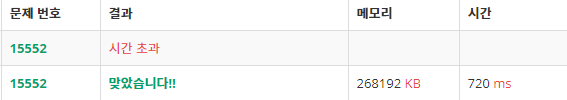

# Algorithm


## #2839

### 설탕 배달 알고리즘 짜기

- 상근이는 요즘 설탕공장에서 설탕을 배달하고 있다. 상근이는 지금 사탕가게에 설탕을 정확하게 N킬로그램을 배달해야 한다. 설탕공장에서 만드는 설탕은 봉지에 담겨져 있다. 봉지는 3킬로그램 봉지와 5킬로그램 봉지가 있다.

  상근이는 귀찮기 때문에, 최대한 적은 봉지를 들고 가려고 한다. 예를 들어, 18킬로그램 설탕을 배달해야 할 때, 3킬로그램 봉지 6개를 가져가도 되지만, 5킬로그램 3개와 3킬로그램 1개를 배달하면, 더 적은 개수의 봉지를 배달할 수 있다.

  상근이가 설탕을 정확하게 N킬로그램 배달해야 할 때, 봉지 몇 개를 가져가면 되는지 그 수를 구하는 프로그램을 작성하시오.

```java
import java.util.Scanner;

public class Main {
	public static void main(String[] args) {
		Scanner scan = new Scanner(System.in);
		int sugar = scan.nextInt();
		int n = -1;
		int a = sugar/5;
		int b = sugar/3;
		boolean check = false;
		
		for (int i = a; i >=0; i--) {
			for (int j = b; j >=0; j--) {
				if (5*i+3*j == sugar) {
					n = i + j;
					check = true;
					break;
				}
			}
		if (check) break;
		}
		System.out.println(n);
	}
```

> ```
> 18
> 4
> 6
> 9
> 11
> ```
>
> ```
> 4
> -1
> 2
> 3
> 3
> ```


### 문제 접근 방식

- 처음에는 주어진 수(int sugar)가 -1로 출력되는 경우와 아닌 경우로 구분하여 생각해보았다.
- 먼저 큰 수인 5로 나누었을 때의 나머지를 a라고 하자. 이 a가 3으로도 나누어 떨어지는 경우에만 봉지의 수가 계산될 수 있다. 

> 1) a = sugar%5 
>
> ​	1-a) a%3 == 0 ... n=sugar/5 + a/3
>
> ​	1-b ) a%3 != 0 ... n=-1

- 그런데 11의 경우, 5로 나눈 나머지가 1이기 때문에 1-b에 해당하여 n=-1이라는 값이 도출된다. 
- 11을 5x1과 3x2로 나누어 생각하려면, 11을 5로 나눈 나머지(2)만 생각할 것이 아니라, 그보다 더 작은 값(1, 0)도 생각해보아야 한다.
- 이때 for문을 사용해야겠다는 생각이 떠올랐다.

> 1) sugar을 5와 3으로 나눈 나머지를 각각 a, b로 둔다.
>
> 2) 큰 수인 a에 대하여 -> 바깥 for문을 구성한다. (int i는 a부터 0까지 점점 작아지도록 설정한다.)
>
> ​	2-a) 작은 수인 b에 대하여 -> 내부 for문을 구성한다. (int j는 b부터 0까지 점점 작아지도록 설정한다.)
>
> ​		for문 내부에서 5*i+3*j=sugar가 되는 경우 (5의 배수 + 3의 배수 조합)를 캐치한다.
>
> ​		이때 i와 j는 각각 5와 3으로 나눈 '몫'에 해당하므로, 곧 설탕 봉지의 개수가 된다.
>
> ​		n = i + j 값을 부여하고  break 한다.

- 그러나 위의 중첩 for문에서 사용한 break에서 문제가 발생했다. 18의 경우, 5x3과 3x1이 되는 경우(n=4)에서 멈추어야 하는데, 5x0과 3x6인 경우까지 진행되어 n이 6으로 출력된 것이다.
- 찾아보니 내부 for문의 break는 바깥 for문에 영향을 주지 못하기 때문에 발생하는 오류였다.
- 따라서 내부 for문에서 원하는 결과물을 찾아낼 경우에 외부 for문까지 break할 수 있도록 임의의 boolean값 check 변수를 설정했다.

> 1) 내부 for문에서 원하는 n값을 도출
>
> 2) check값이 true로 변경
>
> 3) 외부 for문에서 check가 true일 경우 break

- 위와 같은 이중 점검 장치를 통해 n이 최소가 되는 경우를 도출해낼 수 있었다.


## #2348

### 입력한 숫자의 개수만큼 별 찍기

- 첫째 줄에는 별 1개, 둘째 줄에는 별 2개, N번째 줄에는 별 N개를 찍는 문제

```java
import java.util.Scanner;

public class Main {
	public static void main(String[] args) {
		Scanner scan = new Scanner(System.in);
		int a = scan.nextInt();
		for (int i=1; i<=a; i++) {
			for(int j=1; j<=i; j++) {
				System.out.print("*");
			}
			System.out.println();
		}
	}
}
```

> ```
> 5
> ```
>
> ```
> *
> **
> ***
> ****
> *****
> ```

### 문제 접근 방식

- 위 문제는 숫자를 입력받아 문자열을 출력한다는 점에서 독특하다. 그리고 문자열을 출력하는 횟수가 총 입력한 숫자와 같다는 점도 눈여겨볼 만하다.
- 컴퓨터는 별을 n번 입력하는 행위를 "*"을 n번 출력하는 행위로밖에 인식하지 못한다.
- 따라서 하나의 출력 단위를 "*"으로 고정시켜놓고 시작하는 것이 편리하다.
- 응답으로 출력된 부분을 보면 별의 개수가 각각 1, 2, 3, 4, 5개로 차례대로 한 개씩 증가하여 n에 이르는 것을 알 수 있다. 이에 다음과 같은 중첩for문 구조가 필요하다.

> 1) scanner를 통해 입력받은 숫자를 int a에 저장한다.
>
> 2) *의 총 개수에 대하여 -> 바깥 for문을 구성한다 (int i는 1부터 a까지 증가한다)
>
> ​	2-a) *을 반복 출력하는 부분에 대하여 -> 내부 for문을 구성한다. (int j는 1부터 i까지 증가한다)
>
> ​		j의 개수만큼 print 함수를 통해 *을 출력한다 => 한 줄로 구성되도록 println이 아닌 print를 사용한다.
>
> ​	2-b) 내부 for문이 끝나면 개행문자를 입력하여 다음 시행과 구분하도록 한다.


## #2349

### 입력한 숫자의 개수만큼 별 거꾸로 찍기

```java
import java.util.Scanner;

public class Main {
	public static void main(String[] args) {
		Scanner scan = new Scanner(System.in);
		int a = scan.nextInt();
		for (int i=1; i<=a; i++) {
			for(int j=1; j<=a-i; j++) {
				System.out.print(" ");
			}
			for(int k=1; k<=i; k++) {
				System.out.print("*");
			}
			System.out.println();
		}
	}
}
```

> ```
> 5
> ```
>
> ```
>     *
>    **
>   ***
>  ****
> *****
> ```

### 문제 접근 방식

- 위 문제가 2348과 다른 부분은 딱 하나, 공백이 함께 입력된다는 점이다.
- 그러므로 공백을 출력하는 for문 부분만 추가해주면 된다.
- 공백의 개수는 각각 4, 3, 2, 1, 0개로, 이 값은 입력받은 값 a에서 바깥 for문의 i값을 뺀 값이다.
- 그러므로 j라는 인수를 1부터 (a-1)의 값까지 반복시켜 공백 " "을 출력하게 하면 된다.


## #1924

### 특정 날짜에 해당하는 요일 추출하기

- 오늘은 2007년 1월 1일 월요일이다. 그렇다면 2007년 x월 y일은 무슨 요일일까? 이를 알아내는 프로그램을 작성하시오.
- 첫째 줄에 빈 칸을 사이에 두고 x(1≤x≤12)와 y(1≤y≤31)이 주어진다. 참고로 2007년에는 1, 3, 5, 7, 8, 10, 12월은 31일까지, 4, 6, 9, 11월은 30일까지, 2월은 28일까지 있다.

```java
import java.util.Scanner;

public class Main {
	public static void main(String[] args) {
		Scanner scan = new Scanner(System.in);
		int month = scan.nextInt();
		int day = scan.nextInt();
		scan.close();
		
		int [] endDays = {31, 28, 31, 30, 31, 30, 31, 31, 30, 31, 30, 31};
		String [] weekDays = {"SUN", "MON", "TUE", "WED", "THU", "FRI", "SAT"};
		
		int days = day;
		for (int i = 0; i < month-1; i++) {
			days += endDays[i];
		}
		System.out.println(weekDays[days%7]);
	}
}
```

> ```
> 1 1
> 3 14
> 9 2
> 12 25
> ```
>
> ```
> MON
> WED
> SUN
> TUE
> ```

### 문제 접근 방식 1

- 다른 접근 방식

```java
import java.util.Scanner;

public class Main {
	public static void main(String[] args) {
		try {
            String year = "2007";
            Scanner scan = new Scanner(System.in);
            String month = Integer.toString(scan.nextInt());
            String day = Integer.toString(scan.nextInt());
            if (month.length() == 1) {
                month = "0" + month;
            }
            if (day.length() == 1) {
                day = "0" + day;
            }
            String dd = year.concat(month).concat(day);
            SimpleDateFormat sdf = new SimpleDateFormat("yyyyMMdd");
            Date date = sdf.parse(dd);
            Calendar calendar = Calendar.getInstance();
            calendar.setTime(date);
            String[] d = {"SUN", "MON", "TUE", "WED", "THU", "FRI", "SAT"};
            System.out.println(d[calendar.get(Calendar.DAY_OF_WEEK)-1]);
		} catch (Exception e) {
			e.printStackTrace();
		}
	}
}
```

- 위 문제는 처음 다음과 같은 방식으로 접근했다.
- 먼저 년도가 주어지고 월과 일을 입력받는다는 점에서 "yyyyMMdd" 형태의 날짜 포맷 하나를 얻어낼 수 있다고 생각했다.
- 만약 그러하다면 그러한 형태의 date 객체를 실제로 생성하여 어떠한 요일인지 return시킬 수 있다.

> 1) 입력받은 내용을 scan.nextInt로 가져온다.
>
> 2) 이를 바로 String 객체로 바꾸기 위해 Integer의 toString 함수를 이용한다.
>
> 3) 그런데 SimpleDateFormat에 맞추려면 월과 일이 한자리 수인 경우를 고려해야 한다. if문으로 처리한다.
>
> 4) 입력받은 월/일 정보를 연도와 합쳐 날짜 소스를 만들어낸다.
>
> 5) 이후 SimpleDateFormat으로 "yyyyMMdd" 형태를 맞춰준다.
>
> 6) date 객체로 String을 변환시켜준다.
>
> 7) calendar 객체의 Day_OF_WEEK 함수를 이용, 요일 인덱스를 끄집어낸다.
>
> 8) 요일 정보를 담고 있는 String 배열을 만든 뒤 인덱스를 입력하여 요일을 추출한다.

- 마지막 인덱스를 입력하는 부분에서 -1을 해주는 이유는, 인덱스는 0부터 시작하는데 반해 calendar값은 1부터 시작하기 때문이다.

- 위 풀이는 다음과 같은 한계를 지닌다.

  ​	1) 한자리수가 입력되는 경우 때문에 코드가 복잡해진다는 점(if문이 필수적)

  ​	2) for문 챕터인데 for문을 사용하지 않은 점

- 하지만 연도 정보를 바꾸어도 그대로 사용할 수 있다는 점은 이점으로 작용한다.


### 문제 접근 방식 2

- 문제를 다시 한번 읽어보니, 문제에서 굳이 시작하는 날의 요일정보(월요일)와, 매달 끝나는 날짜를 준 것이 수상하다.
- 이를 for문이라는 상황적 정보와 결합하니, 이 문제의 본 의도는 총 날짜수를 이용해 요일을 추출하는 것이었음을 깨달았다.
- 실제로 그러한 방식으로 코드를 사용했을 경우 길이가 단축되고 속도도 향상되었다.

> 1) scanner 객체를 이용해 월/일 정보를 int 객체에 담는다.
>
> 2) 매달 총 일수와 요일 정보를 각각 배열로 만들어 저장한다.
>
> 3) for문을 이용, day까지의 총 날짜수를 구한다.
>
> 3-a) 총 날짜수는 (month-1)까지 해당하는 endDays의 총합 + 입력받은 day값에 해당한다.
>
> 4) 이를 7로 나눈 나머지가 바로 요일 인덱스에 해당한다.

- 이 경우에 1일이 월요일이기 때문에 인덱스 번호와 요일 정보가 일치하게 된다.


## #15552

### 빠른 a+b 계산

-  첫 줄에 테스트케이스의 개수 T가 주어진다. T는 최대 1,000,000이다. 다음 T줄에는 각각 두 정수 A와 B가 주어진다. A와 B는 1 이상, 1,000 이하이다.

```java
import java.io.BufferedReader;
import java.io.BufferedWriter;
import java.io.InputStreamReader;
import java.io.OutputStreamWriter;
import java.util.StringTokenizer;

public class Main {
	public static void main(String[] args) {
		try {
			BufferedReader bf = new BufferedReader(new InputStreamReader(System.in));
			BufferedWriter bw = new BufferedWriter(new OutputStreamWriter(System.out));
			int testCount = Integer.parseInt(bf.readLine());
			for (int i=1; i<=testCount; i++) {
				StringTokenizer st = new StringTokenizer( bf.readLine() );
				int a = Integer.parseInt(st.nextToken());
				int b = Integer.parseInt(st.nextToken());
				bw.write(Integer.toString(a+b)+"\n");
			}
			bw.flush();
			bw.close();
		} catch (Exception e) {
			e.printStackTrace();
		}
	}
}
```

>```
>5
>1 1
>12 34
>5 500
>40 60
>1000 1000
>```
>
>```
>2
>46
>505
>100
>2000
>```

- 처음에 주어진 int 값을 count로 저장하고 이 횟수만큼 for문을 돌리면 되는 간단한 문제이다.

- 그러나 지금까지 사용한 Scanner 객체는 메모리에 많은 부담을 주고, 그러므로 비교적 응답 시간이 오래 걸린다는 단점이 있다.

- 그러므로 입력되는 자료가 많으면 많을수록 buffered 객체를 사용하는 것이 속도 면에서 더 나을 수 있다.

```java
for (int i=1; i<=testCount; i++) {
				StringTokenizer st = new StringTokenizer( bf.readLine() );
				int a = Integer.parseInt(st.nextToken());
				int b = Integer.parseInt(st.nextToken());
				bw.write(Integer.toString(a+b)+"\n");
			}
```

- for 문 내부를 들여다보면 StringTokenizer를 사용한 부분이 인상적이다.
- 기존에 scan.nextInt()로 입력받던 부분을 위와 같이 처리하는데, 먼저 줄 전체를 불러온 다음 nextToken() 메소드를 이용해 return받은 String을 다시 Integer로 변환하는 복잡한 과정을 거쳐야 한다.
- 마찬가지로 bufferedWriter 객체 역시 String만 return할 수 있기  때문에 이를 다시 toString으로 변환해주어야 한다.
- 여러모로 형변환이 잦고 익숙하지 않은 방식이었으나, scanner를 이용한 똑같은 코드는 시간 초과가 나오는 반면 buffered 객체를 이용한 경우 720ms로 평소보다 빠른 수행 결과를 얻을 수 있었다.

```java
import java.util.Scanner;

public class Main {
    public static void main(String[] args) {
		Scanner scan = new Scanner(System.in);
		int total = scan.nextInt();
		for (int i = 1; i <= total; i++) {
            int a = scan.nextInt();
            int b = scan.nextInt();
            System.out.println(a+b);
		}
    }
}
```

> 
>
> 똑같은 결과를 냈지만 상반된 결과가 나타났다.

